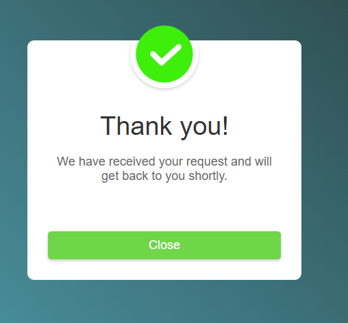

# Popup Project

This project demonstrates a simple popup functionality using HTML, CSS, and JavaScript.

## Features
- A button to trigger a popup.
- Smooth animations for showing and hiding the popup.
- Responsive design.

## Screenshot

## Live Demo
[View Live Demo](https://devcodingskill.github.io/Popup/)

## How to Use
1. Clone the repository to your local machine.
2. Open `index.html` in your browser.
3. Click the "Click Me" button to display the popup.
4. Click the "Close" button to hide the popup.

## Project Structure